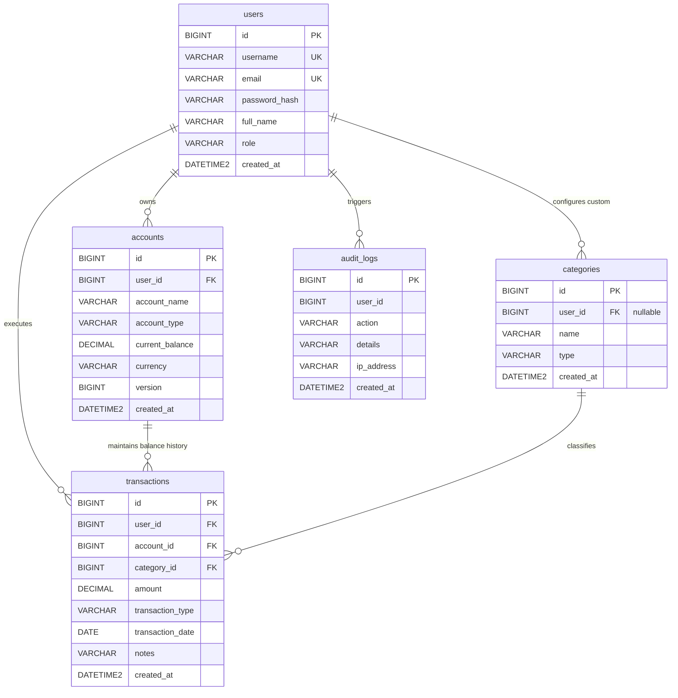
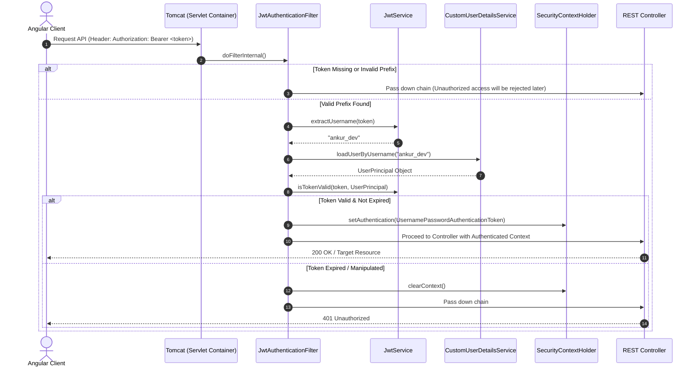
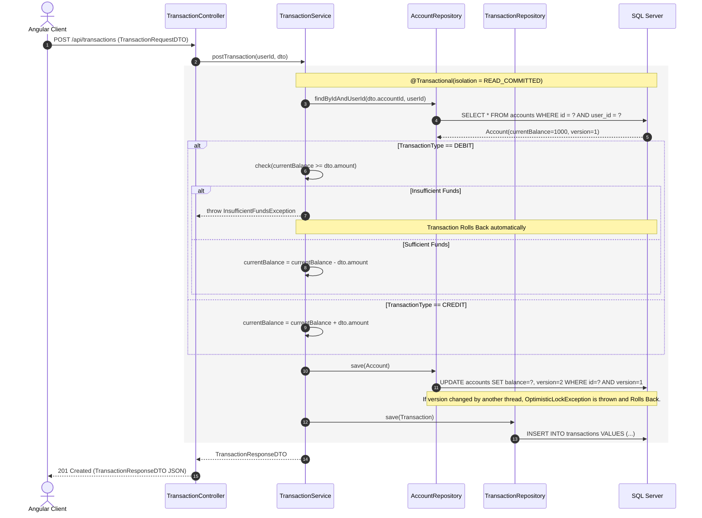
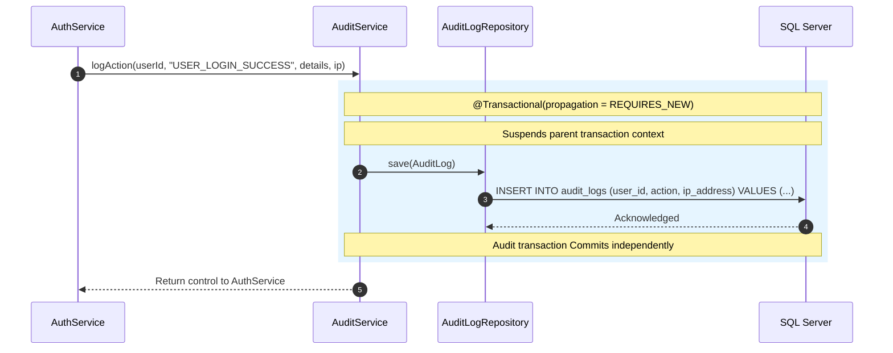
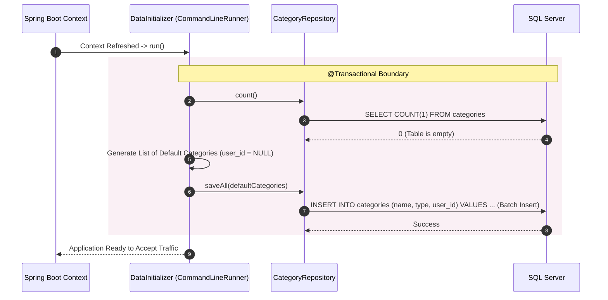
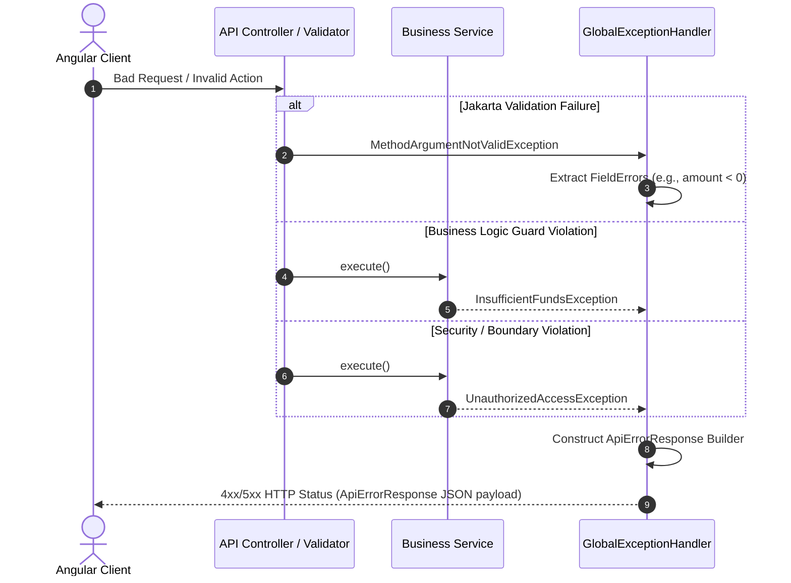

# Money Manager — System Architecture & Implementation Guide

---

## High-Level Architecture

The application implements a decoupled, three-tier architecture with token-based stateless security:

```text
[ Angular 19+ SPA (Client) ]
         │
         │  HTTP / REST (JSON) + Bearer JWT
         ▼
[ Spring Boot 3.x / 4.x Application Tier ]
   ├── Security Filter Pipeline (JwtAuthenticationFilter)
   ├── Controller Layer (REST Endpoints)
   ├── Service Layer (Business Rules & Optimistic Locking)
   └── Spring Data JPA / Hibernate ORM Layer
         │
         │  JDBC (HikariCP)
         ▼
[ Microsoft SQL Server 2022 Database Tier ]
```

* **Client Tier:** Angular standalone architecture using zoneless change detection (`provideZonelessChangeDetection`), functional HTTP interceptors (`HttpInterceptorFn`), and reactive forms.
* **API & Business Tier:** Spring Boot utilizing Spring Security 6 for stateless JWT validation, Spring Data JPA for persistence abstractions, and `@Version` optimistic concurrency control.
* **Database Tier:** Microsoft SQL Server using `decimal(19, 4)` precision types for double-entry currency integrity, identity columns, foreign keys, and audit logging.

---

## Tech Stack Breakdown

* **Backend Framework:** Spring Boot (Java 21/25)
* **ORM / Persistence:** Spring Data JPA, Hibernate ORM 7.x
* **Security:** Spring Security 6, JJWT (`io.jsonwebtoken`)
* **Database Driver:** Microsoft JDBC Driver for SQL Server
* **Database Engine:** Microsoft SQL Server 2022 (`MoneyManagerDB`)
* **Frontend Framework:** Angular 19+ (Standalone Components, TypeScript)
* **HTTP Client Pipeline:** Angular `@angular/common/http` with functional Interceptors
* **State & Change Detection:** Native Zoneless Change Detection (`provideZonelessChangeDetection`)
* **Styling:** Custom Modular SCSS, CSS Flexbox & CSS Grid

---

## Database Domain Model & Schema Specifications

### Base Entity Lifecycle

All tables inherit auditing timestamp tracking from `BaseEntity`:
* `created_at DATETIME2 NOT NULL`: Populated automatically at entity creation via `@PrePersist` hooks.

---

### Entity Data Dictionaries

#### 1. Table: `users`
Represents customer/principal identities in the system.

| Column | SQL Type | Constraints | Description |
| :--- | :--- | :--- | :--- |
| `id` | `BIGINT` | `PRIMARY KEY IDENTITY(1,1)` | Internal surrogate user identifier |
| `username` | `VARCHAR(50)` | `NOT NULL UNIQUE` | Unique client login handle |
| `email` | `VARCHAR(100)` | `NOT NULL UNIQUE` | Unique client communication address |
| `password_hash` | `VARCHAR(255)` | `NOT NULL` | BCrypt/Argon2 one-way hashed credential |
| `full_name` | `VARCHAR(100)` | `NOT NULL` | Legal full name of the user |
| `role` | `VARCHAR(20)` | `NOT NULL DEFAULT 'ROLE_USER'` | Access control boundary |
| `created_at` | `DATETIME2` | `NOT NULL` | Timestamp of account registration |

---

#### 2. Table: `accounts`
Stores financial holdings, checking accounts, and credit limits. Implements optimistic concurrency.

| Column | SQL Type | Constraints | Description |
| :--- | :--- | :--- | :--- |
| `id` | `BIGINT` | `PRIMARY KEY IDENTITY(1,1)` | Internal account identifier |
| `user_id` | `BIGINT` | `NOT NULL, FK -> users(id)` | Ownership link to the parent user |
| `account_name` | `VARCHAR(100)` | `NOT NULL` | Label given by the user |
| `account_type` | `VARCHAR(20)` | `NOT NULL` | `CHECKING`, `SAVINGS`, or `CREDIT_CARD` |
| `current_balance` | `DECIMAL(19, 4)`| `NOT NULL DEFAULT 0.0000` | Current audited ledger balance |
| `currency` | `VARCHAR(3)` | `NOT NULL DEFAULT 'INR'` | ISO-4217 standard currency code |
| `version` | `BIGINT` | `NOT NULL` | Optimistic locking counter to prevent race conditions |
| `created_at` | `DATETIME2` | `NOT NULL` | Timestamp of account initialization |

---

#### 3. Table: `categories`
Hierarchical categorization tree for cash flows. Supports both global system presets and user-defined custom categories.

| Column | SQL Type | Constraints | Description |
| :--- | :--- | :--- | :--- |
| `id` | `BIGINT` | `PRIMARY KEY IDENTITY(1,1)` | Category identifier |
| `user_id` | `BIGINT` | `NULLABLE, FK -> users(id)` | `NULL` = System preset; `Value` = Custom user tag |
| `name` | `VARCHAR(50)` | `NOT NULL` | Human-readable tag (e.g., Salary, Groceries) |
| `type` | `VARCHAR(10)` | `NOT NULL` | Category orientation: `INCOME` or `EXPENSE` |
| `created_at` | `DATETIME2` | `NOT NULL` | Record generation timestamp |

---

#### 4. Table: `transactions`
Immutable journal entries for deposits, withdrawals, transfers, and purchases.

| Column | SQL Type | Constraints | Description |
| :--- | :--- | :--- | :--- |
| `id` | `BIGINT` | `PRIMARY KEY IDENTITY(1,1)` | Primary transaction ledger sequence number |
| `user_id` | `BIGINT` | `NOT NULL, FK -> users(id)` | User executing or owning the entry |
| `account_id` | `BIGINT` | `NOT NULL, FK -> accounts(id)` | Target account impacted by the ledger entry |
| `category_id` | `BIGINT` | `NOT NULL, FK -> categories(id)` | Reporting classification |
| `amount` | `DECIMAL(19, 4)`| `NOT NULL` | High-precision numeric value of the journal entry |
| `transaction_type` | `VARCHAR(10)` | `NOT NULL` | Flow direction: `DEBIT` (outflow) or `CREDIT` (inflow) |
| `transaction_date` | `DATE` | `NOT NULL` | Accounting effective transaction date |
| `notes` | `VARCHAR(255)` | `NULLABLE` | Optional narrative context / remarks |
| `created_at` | `DATETIME2` | `NOT NULL` | System physical insertion timestamp |

---

#### 5. Table: `audit_logs`
Asynchronous, append-only security and operational audit trace.

| Column | SQL Type | Constraints | Description |
| :--- | :--- | :--- | :--- |
| `id` | `BIGINT` | `PRIMARY KEY IDENTITY(1,1)` | Unique audit record sequence |
| `user_id` | `BIGINT` | `NULLABLE` | Actor identifier |
| `action` | `VARCHAR(50)` | `NOT NULL` | System event identifier (e.g., `LOGIN_SUCCESS`, `CREATE_ACCOUNT`) |
| `details` | `VARCHAR(500)` | `NULLABLE` | Metadata, exceptions, or operation context |
| `ip_address` | `VARCHAR(45)` | `NULLABLE` | IPv4 or IPv6 client origin string |
| `created_at` | `DATETIME2` | `NOT NULL` | Immutable audit log event timestamp |

---

## Entity Relationship Diagram (ERD)


## Data Transfer Objects (DTOs) & API Contracts

All request payloads undergo Jakarta Bean Validation (`@Valid`) at the controller boundary before hitting the business service layer. Validation errors are trapped globally and returned as structured `ApiErrorResponse` payloads with HTTP `400 Bad Request`.

---

### Standard Error Response: `ApiErrorResponse`

Used across all endpoints for uniform error handling (validation errors, domain violations, security rejections):

| Field | Type | Description |
| :--- | :--- | :--- |
| `timestamp` | `LocalDateTime` | Exact server timestamp of error occurrence |
| `status` | `int` | HTTP numeric status code (e.g., `400`, `401`, `403`, `404`, `500`) |
| `error` | `String` | HTTP reason phrase (e.g., `"Bad Request"`, `"Validation Failed"`) |
| `message` | `String` | High-level summary of the issue |
| `path` | `String` | Request URI that triggered the failure |
| `validationErrors` | `Map<String, String>` | Key-value mapping of invalid property names to constraint violation messages |

```json
{
  "timestamp": "2026-09-13T11:21:28.3589164",
  "status": 400,
  "error": "Validation Failed",
  "message": "One or more input fields failed validation constraints",
  "path": "/api/accounts",
  "validationErrors": {
    "initialBalance": "Initial balance cannot be negative",
    "currency": "Currency code must be exactly 3 characters (e.g., INR, USD)"
  }
}
```

---

### Authentication Module DTOs

#### 1. Registration Request: `RegisterRequestDTO`

* **Target Endpoint:** `POST /api/auth/register`
* **Access Boundary:** Public

| Field | Type | Validation Constraints | Description |
| :--- | :--- | :--- | :--- |
| `username` | `String` | `@NotBlank`, `@Size(min = 3, max = 50)` | Unique handle for client identity |
| `email` | `String` | `@NotBlank`, `@Email`, `@Size(max = 100)` | Unique email address |
| `password` | `String` | `@NotBlank`, `@Size(min = 8, max = 100)` | Raw password (hashed with BCrypt before persistence) |
| `fullName` | `String` | `@NotBlank`, `@Size(max = 100)` | Legal user name |

```json
{
  "username": "ankur_dev",
  "email": "ankur@example.com",
  "password": "Password123",
  "fullName": "Ankur Mukherjee"
}
```

#### 2. Login Request: `LoginRequestDTO`

* **Target Endpoint:** `POST /api/auth/login`
* **Access Boundary:** Public

| Field | Type | Validation Constraints | Description |
| :--- | :--- | :--- | :--- |
| `usernameOrEmail` | `String` | `@NotBlank` | Accepts either registered username or email address |
| `password` | `String` | `@NotBlank` | Raw authentication secret |

```json
{
  "usernameOrEmail": "ankur_dev",
  "password": "Password123"
}
```

#### 3. Authentication Response: `AuthResponseDTO`

* **Returned By:** `POST /api/auth/login` & `POST /api/auth/register`

| Field | Type | Description |
| :--- | :--- | :--- |
| `token` | `String` | Signed JWT Bearer token |
| `tokenType` | `String` | Standard prefix (`"Bearer"`) |
| `userId` | `Long` | Primary database identifier of authenticated user |
| `username` | `String` | User handle |
| `email` | `String` | User email address |

```json
{
  "token": "eyJhbGciOiJIUzI1NiIsIn...",
  "tokenType": "Bearer",
  "userId": 1,
  "username": "ankur_dev",
  "email": "ankur@example.com"
}
```

---

### Account Module DTOs

#### 1. Create Account Request: `AccountRequestDTO`

* **Target Endpoint:** `POST /api/accounts`
* **Access Boundary:** Protected (`ROLE_USER`)

| Field | Type | Validation Constraints | Description |
| :--- | :--- | :--- | :--- |
| `accountName` | `String` | `@NotBlank`, `@Size(max = 100)` | Human-readable account label |
| `accountType` | `AccountType` | `@NotNull` | Enum: `CHECKING`, `SAVINGS`, or `CREDIT_CARD` |
| `initialBalance` | `BigDecimal` | `@NotNull`, `@PositiveOrZero` | Starting balance for ledger initialization |
| `currency` | `String` | `@NotBlank`, `@Size(min = 3, max = 3)` | ISO-4217 currency code (default: `"INR"`) |

```json
{
  "accountName": "Salary Checking",
  "accountType": "CHECKING",
  "initialBalance": 50000.00,
  "currency": "INR"
}
```

#### 2. Account Response: `AccountResponseDTO`

* **Returned By:** `POST /api/accounts`, `GET /api/accounts`, `GET /api/accounts/{id}`

| Field | Type | Description |
| :--- | :--- | :--- |
| `id` | `Long` | Unique account sequence identifier |
| `accountName` | `String` | Display label |
| `accountType` | `AccountType` | Enum value: `CHECKING`, `SAVINGS`, or `CREDIT_CARD` |
| `currentBalance` | `BigDecimal` | Current audited running balance |
| `currency` | `String` | ISO-4217 currency denomination |
| `version` | `Long` | Optimistic locking iteration token |
| `createdAt` | `LocalDateTime` | Record creation timestamp |

```json
{
  "id": 1,
  "accountName": "Salary Checking",
  "accountType": "CHECKING",
  "currentBalance": 50000.0000,
  "currency": "INR",
  "version": 0,
  "createdAt": "2026-09-13T10:45:00.123456"
}
```

---

### Category Module DTOs

#### 1. Create Category Request: `CategoryRequestDTO`

* **Target Endpoint:** `POST /api/categories`
* **Access Boundary:** Protected (`ROLE_USER`)

| Field | Type | Validation Constraints | Description |
| :--- | :--- | :--- | :--- |
| `name` | `String` | `@NotBlank`, `@Size(max = 50)` | Distinct category tag name |
| `type` | `CategoryType` | `@NotNull` | Flow nature: `EXPENSE` or `INCOME` |

```json
{
  "name": "Groceries",
  "type": "EXPENSE"
}
```

#### 2. Category Response: `CategoryResponseDTO`

* **Returned By:** `POST /api/categories`, `GET /api/categories`

| Field | Type | Description |
| :--- | :--- | :--- |
| `id` | `Long` | Unique category sequence number |
| `name` | `String` | Human-readable category label |
| `type` | `CategoryType` | `EXPENSE` or `INCOME` |
| `isSystemDefault` | `boolean` | `true` if preset seeded category; `false` if custom user category |
| `createdAt` | `LocalDateTime` | Creation timestamp |

```json
{
  "id": 4,
  "name": "Salary",
  "type": "INCOME",
  "isSystemDefault": true,
  "createdAt": "2026-09-13T10:00:00"
}
```

---

### Transaction Module DTOs

#### 1. Create Transaction Request: `TransactionRequestDTO`

* **Target Endpoint:** `POST /api/transactions`
* **Access Boundary:** Protected (`ROLE_USER`)

| Field | Type | Validation Constraints | Description |
| :--- | :--- | :--- | :--- |
| `accountId` | `Long` | `@NotNull` | Target account being credited or debited |
| `categoryId` | `Long` | `@NotNull` | Target classification category |
| `amount` | `BigDecimal` | `@NotNull`, `@DecimalMin("0.01")`, `@Digits(integer = 15, fraction = 4)` | Journal amount (positive number, up to 4 decimal places) |
| `transactionType` | `TransactionType` | `@NotNull` | Direction of funds: `DEBIT` (expense) or `CREDIT` (income) |
| `transactionDate` | `LocalDate` | `@NotNull`, `@PastOrPresent` | Effective accounting date (cannot be future date) |
| `notes` | `String` | `@Size(max = 255)` | Optional memo or transaction narration |

```json
{
  "accountId": 1,
  "categoryId": 2,
  "amount": 1450.50,
  "transactionType": "DEBIT",
  "transactionDate": "2026-09-13",
  "notes": "Swiggy weekend dinner order"
}
```

#### 2. Transaction Response: `TransactionResponseDTO`

* **Returned By:** `POST /api/transactions`, `GET /api/transactions`, `GET /api/transactions/account/{accountId}`

| Field | Type | Description |
| :--- | :--- | :--- |
| `id` | `Long` | Unique immutable journal sequence number |
| `accountId` | `Long` | Foreign key reference to impacted account |
| `accountName` | `String` | Dereferenced account name for display convenience |
| `categoryId` | `Long` | Foreign key reference to assigned category |
| `categoryName` | `String` | Dereferenced category name for display convenience |
| `amount` | `BigDecimal` | Exact transaction currency value |
| `transactionType` | `TransactionType` | `DEBIT` or `CREDIT` |
| `transactionDate` | `LocalDate` | Accounting effective date |
| `notes` | `String` | Transaction memo/remarks |
| `createdAt` | `LocalDateTime` | Insertion audit timestamp |

```json
{
  "id": 101,
  "accountId": 1,
  "accountName": "Salary Checking",
  "categoryId": 2,
  "categoryName": "Food & Dining",
  "amount": 1450.5000,
  "transactionType": "DEBIT",
  "transactionDate": "2026-09-13",
  "notes": "Swiggy weekend dinner order",
  "createdAt": "2026-09-13T11:35:10.829143"
}
```

## REST API Endpoint Directory & Security Specifications

All REST endpoints reside under the `/api` root namespace. Endpoints secured with `@AuthenticationPrincipal UserPrincipal principal` enforce user isolation: queries automatically bind to `principal.getId()` to prevent cross-tenant data leaks.

---

### API Endpoint Registry

| Module | HTTP Method | Route | Access Level | Request Body | Query / Path Params | Success Status | Description |
| :--- | :--- | :--- | :--- | :--- | :--- | :--- | :--- |
| **Auth** | `POST` | `/api/auth/register` | Public | `RegisterRequestDTO` | — | `201 Created` | Registers user, logs client IP, issues JWT |
| **Auth** | `POST` | `/api/auth/login` | Public | `LoginRequestDTO` | — | `200 OK` | Authenticates credentials, issues JWT |
| **Accounts** | `POST` | `/api/accounts` | Authenticated | `AccountRequestDTO` | — | `201 Created` | Initializes an account with opening balance |
| **Accounts** | `GET` | `/api/accounts` | Authenticated | — | — | `200 OK` | Retrieves all accounts belonging to the caller |
| **Accounts** | `GET` | `/api/accounts/{id}` | Authenticated | — | `id` (Long) | `200 OK` | Fetches a single account by ID (user-isolated) |
| **Categories** | `GET` | `/api/categories` | Authenticated | — | — | `200 OK` | Lists system defaults and custom user categories |
| **Categories** | `POST` | `/api/categories` | Authenticated | `CategoryRequestDTO` | — | `201 Created` | Creates a custom classification category |
| **Categories** | `DELETE` | `/api/categories/{id}` | Authenticated | — | `id` (Long) | `204 No Content` | Removes a custom user category |
| **Transactions** | `POST` | `/api/transactions` | Authenticated | `TransactionRequestDTO` | — | `201 Created` | Posts a debit/credit and updates ledger balance |
| **Transactions** | `GET` | `/api/transactions` | Authenticated | — | — | `200 OK` | Retrieves user transaction ledger history |
| **Transactions** | `GET` | `/api/transactions/filter` | Authenticated | — | `startDate`, `endDate` (ISO Date) | `200 OK` | Filters user transactions within date boundary |
| **Transactions** | `GET` | `/api/transactions/account/{accountId}` | Authenticated | — | `accountId` (Long) | `200 OK` | Retrieves all ledger entries for a specific account |

---

### Detailed API Specifications

#### 1. Authentication Endpoints

##### Register New User
* **Method & URI:** `POST /api/auth/register`
* **Security:** Public (No authorization header required)
* **Client IP Audit:** Extracted from `X-Forwarded-For` header or `request.getRemoteAddr()`
* **Request Body:**
  ```json
  {
    "username": "ankur_dev",
    "email": "ankur@example.com",
    "password": "Password123",
    "fullName": "Ankur Mukherjee"
  }
  ```
* **Success Response (`201 Created`):**
  ```json
  {
    "token": "eyJhbGciOiJIUzI1NiIsIn...",
    "tokenType": "Bearer",
    "userId": 1,
    "username": "ankur_dev",
    "email": "ankur@example.com"
  }
  ```
* **Failure Responses:**
    * `400 Bad Request`: Field validation failure or duplicate unique constraint violation (username/email already exists).

##### User Login
* **Method & URI:** `POST /api/auth/login`
* **Security:** Public
* **Request Body:**
  ```json
  {
    "usernameOrEmail": "ankur_dev",
    "password": "Password123"
  }
  ```
* **Success Response (`200 OK`):**
  ```json
  {
    "token": "eyJhbGciOiJIUzI1NiIsIn...",
    "tokenType": "Bearer",
    "userId": 1,
    "username": "ankur_dev",
    "email": "ankur@example.com"
  }
  ```
* **Failure Responses:**
    * `400 Bad Request`: Validation failure on empty username or password.
    * `401 Unauthorized`: Invalid credentials / bad credentials exception.

---

#### 2. Account Endpoints

All account operations require an `Authorization: Bearer <token>` header.

##### Create Account
* **Method & URI:** `POST /api/accounts`
* **Request Body:**
  ```json
  {
    "accountName": "Salary Checking",
    "accountType": "CHECKING",
    "initialBalance": 50000.00,
    "currency": "INR"
  }
  ```
* **Success Response (`201 Created`):**
  ```json
  {
    "id": 1,
    "accountName": "Salary Checking",
    "accountType": "CHECKING",
    "currentBalance": 50000.0000,
    "currency": "INR",
    "version": 0,
    "createdAt": "2026-09-13T10:45:00.123456"
  }
  ```

##### Fetch All User Accounts
* **Method & URI:** `GET /api/accounts`
* **Success Response (`200 OK`):**
  ```json
  [
    {
      "id": 1,
      "accountName": "Salary Checking",
      "accountType": "CHECKING",
      "currentBalance": 50000.0000,
      "currency": "INR",
      "version": 0,
      "createdAt": "2026-09-13T10:45:00"
    },
    {
      "id": 2,
      "accountName": "Emergency Savings",
      "accountType": "SAVINGS",
      "currentBalance": 20000.0000,
      "currency": "INR",
      "version": 0,
      "createdAt": "2026-09-13T10:46:00"
    }
  ]
  ```

##### Fetch Account By ID
* **Method & URI:** `GET /api/accounts/{id}`
* **Success Response (`200 OK`):**
  ```json
  {
    "id": 1,
    "accountName": "Salary Checking",
    "accountType": "CHECKING",
    "currentBalance": 50000.0000,
    "currency": "INR",
    "version": 0,
    "createdAt": "2026-09-13T10:45:00"
  }
  ```
* **Failure Responses:**
    * `404 Not Found`: Account ID does not exist or does not belong to authenticated user.

---

#### 3. Category Endpoints

##### Fetch Categories
* **Method & URI:** `GET /api/categories`
* **Description:** Retrieves all global system presets (`user_id = NULL`) plus custom categories configured by the active user (`user_id = principal.getId()`).
* **Success Response (`200 OK`):**
  ```json
  [
    {
      "id": 1,
      "name": "Food & Dining",
      "type": "EXPENSE",
      "isSystemDefault": true,
      "createdAt": "2026-09-13T10:00:00"
    },
    {
      "id": 2,
      "name": "Salary",
      "type": "INCOME",
      "isSystemDefault": true,
      "createdAt": "2026-09-13T10:00:00"
    },
    {
      "id": 15,
      "name": "Freelance Client Work",
      "type": "INCOME",
      "isSystemDefault": false,
      "createdAt": "2026-09-13T11:00:00"
    }
  ]
  ```

##### Create Custom Category
* **Method & URI:** `POST /api/categories`
* **Request Body:**
  ```json
  {
    "name": "Freelance Client Work",
    "type": "INCOME"
  }
  ```
* **Success Response (`201 Created`):**
  ```json
  {
    "id": 15,
    "name": "Freelance Client Work",
    "type": "INCOME",
    "isSystemDefault": false,
    "createdAt": "2026-09-13T11:00:00"
  }
  ```

##### Delete Custom Category
* **Method & URI:** `DELETE /api/categories/{id}`
* **Success Response (`204 No Content`)**
* **Failure Responses:**
    * `400 Bad Request`: Cannot delete a default system category (`isSystemDefault = true`).
    * `404 Not Found`: Category does not exist or does not belong to active caller.

---

#### 4. Transaction Endpoints

##### Post New Transaction (Ledger Entry)
* **Method & URI:** `POST /api/transactions`
* **Transactional Behavior:** Atomically writes ledger journal record and recalculates/updates `current_balance` on the corresponding `Account` under `@Version` concurrency control.
* **Request Body:**
  ```json
  {
    "accountId": 1,
    "categoryId": 1,
    "amount": 1450.50,
    "transactionType": "DEBIT",
    "transactionDate": "2026-09-13",
    "notes": "Swiggy weekend dinner order"
  }
  ```
* **Success Response (`201 Created`):**
  ```json
  {
    "id": 101,
    "accountId": 1,
    "accountName": "Salary Checking",
    "categoryId": 1,
    "categoryName": "Food & Dining",
    "amount": 1450.5000,
    "transactionType": "DEBIT",
    "transactionDate": "2026-09-13",
    "notes": "Swiggy weekend dinner order",
    "createdAt": "2026-09-13T11:35:10"
  }
  ```
* **Failure Responses:**
    * `400 Bad Request`: Validation failure, insufficient account balance for `DEBIT`, or invalid account/category associations.

##### Fetch All Transactions
* **Method & URI:** `GET /api/transactions`
* **Success Response (`200 OK`):**
  ```json
  [
    {
      "id": 101,
      "accountId": 1,
      "accountName": "Salary Checking",
      "categoryId": 1,
      "categoryName": "Food & Dining",
      "amount": 1450.5000,
      "transactionType": "DEBIT",
      "transactionDate": "2026-09-13",
      "notes": "Swiggy weekend dinner order",
      "createdAt": "2026-09-13T11:35:10"
    }
  ]
  ```

##### Filter Transactions by Date Range
* **Method & URI:** `GET /api/transactions/filter?startDate=2026-09-01&endDate=2026-09-30`
* **Query Parameters:**
    * `startDate` (ISO Date format: `YYYY-MM-DD`): Beginning of search range
    * `endDate` (ISO Date format: `YYYY-MM-DD`): End of search range
* **Success Response (`200 OK`):** List of transactions matching boundary.

##### Fetch Transactions by Account
* **Method & URI:** `GET /api/transactions/account/{accountId}`
* **Path Parameters:**
    * `accountId` (Long): Target account sequence number
* **Success Response (`200 OK`):** Chronological ledger rows tied to the selected account.

## Business Service Architecture & Transactional Pipeline

The service layer contains the application's business rules, multi-tenant boundaries, audit tracking, and database transaction lifecycles.

---

### Transactional Boundaries & Concurrency Strategy

* **Tenant Isolation Strategy:**
    * No entities are read or modified using naked primary keys (`findById(id)`) unless combined with `userId` predicates.
    * Methods use tenant-aware queries (`findByIdAndUserId`, `findAllByUserId`, `findByUserIdOrUserIdIsNull`) to isolate each user's financial ledger records.
* **Isolation Level (`READ_COMMITTED`):**
    * `TransactionService.postTransaction` runs explicitly under `@Transactional(isolation = Isolation.READ_COMMITTED, rollbackFor = Exception.class)`.
    * Prevents reading uncommitted (dirty) rows during balance recalculations while permitting high-throughput row updates on SQL Server.
* **Optimistic Locking via `@Version`:**
    * `Account` balance updates use the entity's `@Version` property.
    * Hibernate checks the update version predicate (`WHERE id = ? AND version = ?`). If an interleaving transaction commits first, an `OptimisticLockException` triggers an automatic rollback of both the account adjustment and the ledger insertion.
* **Audit Isolation via `REQUIRES_NEW`:**
    * `AuditService.logAction` uses `@Transactional(propagation = Propagation.REQUIRES_NEW)`.
    * Suspends any active ambient transaction to write the audit trail record in an independent database physical transaction, ensuring security event tracking is preserved.
* **Read-Only Performance Optimization:**
    * All lookup operations use `@Transactional(readOnly = true)`.
    * Skips Hibernate dirty-checking snapshots and enables database engine read-path optimizations.

---

### Service Component Inventory

| Service | Key Dependencies | Primary Responsibilities | Transactional Scope |
| :--- | :--- | :--- | :--- |
| **`AuthService`** | `UserRepository`, `PasswordEncoder`, `JwtService`, `AuthenticationManager`, `AuditService` | User onboarding, credential validation, BCrypt password hashing, JWT minting, audit registration | `@Transactional` (write/register), `@Transactional(readOnly = true)` (login) |
| **`AccountService`** | `AccountRepository`, `UserRepository` | Account lifecycle management, multi-tenant account lookup, initial balance configuration | `@Transactional` (create), `@Transactional(readOnly = true)` (reads) |
| **`TransactionService`** | `TransactionRepository`, `AccountRepository`, `CategoryRepository`, `UserRepository` | Balance verification, overdraft prevention, atomic debit/credit adjustments, journal insertions | `@Transactional(isolation = READ_COMMITTED)` (post), `@Transactional(readOnly = true)` (reads) |
| **`CategoryService`** | `CategoryRepository`, `UserRepository` | Custom category creation, tenant + system-default category union queries, protected deletion checks | `@Transactional` (create/delete), `@Transactional(readOnly = true)` (reads) |
| **`AuditService`** | `AuditLogRepository` | Immutable operational logging for user signups, sign-ins, and critical security actions | `@Transactional(propagation = REQUIRES_NEW)` |

---

### Core Business Rules & Invariants

#### 1. Overdraft Prevention (`InsufficientFundsException`)
In `TransactionService.postTransaction`, when `transactionType == DEBIT`:
* The account's `currentBalance` is evaluated against the incoming transaction `amount` via `BigDecimal.compareTo()`.
* If `currentBalance.compareTo(amount) < 0`, an `InsufficientFundsException` is thrown immediately.
* Spring marks the transaction for rollback, preventing negative balances on checking and savings accounts.

#### 2. System Default Category Protection (`UnauthorizedAccessException`)
In `CategoryService.deleteCustomCategory`:
* A category is identified as a system-wide default if its `user` reference is `null` (`isSystemDefault == true`).
* Attempting to delete a category where `category.getUser() == null` throws an `UnauthorizedAccessException("System default categories cannot be deleted.")`.
* Attempting to delete a category belonging to another tenant (`!category.getUser().getId().equals(userId)`) throws an `UnauthorizedAccessException("You are not authorized to delete this category.")`.

#### 3. Identity Uniqueness Invariant
In `AuthService.register`:
* Enforces explicit, case-insensitive uniqueness checks for both `username` and `email` before invoking the password hashing engine.
* Prevents leaking unhandled SQL Server unique constraint violations to the client.

## Data Access Layer & Repository Specifications

The persistence layer is implemented using Spring Data JPA. Query methods enforce tenant-level data segregation, prevent Insecure Direct Object Reference (IDOR) vulnerabilities, and manage chronological ledger indexing.

---

### Tenant-Boundary & Security Patterns

* **IDOR Mitigation:** Entity access methods require composite criteria (`findByIdAndUserId`) rather than bare primary keys (`findById`). If an authenticated user attempts to read, modify, or delete a resource owned by another tenant, the query returns an empty `Optional`, which is mapped to a 404/403 exception rather than leaking the resource state.
* **Hybrid Category Retrieval:** The category domain utilizes a nullable foreign key design pattern. A single query (`findByUserIdOrUserIdIsNull`) performs a union fetch at the database level to load both global system defaults (`user_id IS NULL`) and private tenant categories (`user_id = ?`) in one round trip.
* **Deterministic Chronological Ordering:** Transaction histories are sorted descending by date (`OrderByTransactionDateDesc`) directly in SQL Server, ensuring ledger queries return the newest activity at index zero.

---

### Repository Method Registry

#### 1. `UserRepository`

Manages account access, onboarding lookups, and identity uniqueness checks.

| Method Signature | Generated SQL Predicate | Usage Context |
| :--- | :--- | :--- |
| `findByUsername(String username)` | `WHERE username = ?` | Authentication lookup (sign-in via username) |
| `findByEmail(String email)` | `WHERE email = ?` | Authentication lookup (sign-in via email address) |
| `existsByUsername(String username)` | `SELECT CASE WHEN COUNT(1) > 0 ... WHERE username = ?` | Registration pre-flight validation |
| `existsByEmail(String email)` | `SELECT CASE WHEN COUNT(1) > 0 ... WHERE email = ?` | Registration pre-flight validation |

---

#### 2. `AccountRepository`

Enforces isolation of financial balances and account metadata.

| Method Signature | Generated SQL Predicate | Usage Context |
| :--- | :--- | :--- |
| `findAllByUserId(Long userId)` | `WHERE user_id = ?` | Dashboard rendering of all active caller accounts |
| `findByIdAndUserId(Long id, Long userId)` | `WHERE id = ? AND user_id = ?` | IDOR-safe single account inspection and debit/credit mutations |

---

#### 3. `CategoryRepository`

Manages cash-flow classifications and system default rules.

| Method Signature | Generated SQL Predicate | Usage Context |
| :--- | :--- | :--- |
| `findByUserIdOrUserIdIsNull(Long userId)` | `WHERE user_id = ? OR user_id IS NULL` | Populates category selection controls in transaction forms |
| `findByIdAndUserId(Long id, Long userId)` | `WHERE id = ? AND user_id = ?` | Verifies user ownership before executing category deletions |

---

#### 4. `TransactionRepository`

Provides chronological read patterns for immutable double-entry journal records.

| Method Signature | Generated SQL Predicate | Usage Context |
| :--- | :--- | :--- |
| `findAllByUserIdOrderByTransactionDateDesc(Long userId)` | `WHERE user_id = ? ORDER BY transaction_date DESC` | Global user ledger retrieval |
| `findByIdAndUserId(Long id, Long userId)` | `WHERE id = ? AND user_id = ?` | IDOR-safe inspection of a single transaction record |
| `findAllByAccountIdAndUserId(Long accountId, Long userId)` | `WHERE account_id = ? AND user_id = ?` | Account-specific statement reconciliation |
| `findAllByUserIdAndTransactionDateBetweenOrderByTransactionDateDesc(...)` | `WHERE user_id = ? AND transaction_date BETWEEN ? AND ? ORDER BY transaction_date DESC` | Date-filtered financial statements and reporting |

---

#### 5. `AuditLogRepository`

Handles access to historical security and business audit records.

| Method Signature | Generated SQL Predicate | Usage Context |
| :--- | :--- | :--- |
| `findAllByUserIdOrderByCreatedAtDesc(Long userId)` | `WHERE user_id = ? ORDER BY created_at DESC` | User access and activity audit trail inspection |


## Security & Authentication Architecture

The security framework uses Spring Security 6 configured for stateless JSON Web Token (JWT) validation, HMAC-SHA256 signature verification, and Cross-Origin Resource Sharing (CORS) enforcement.

---

### Security Architecture Overview

* **Stateless Session Management:** `SessionCreationPolicy.STATELESS` ensures the server creates no HTTP sessions; each request is authenticated independently via bearer tokens.
* **Filter Ordering:** `JwtAuthenticationFilter` executes before Spring Security's standard `UsernamePasswordAuthenticationFilter`, extracting credentials and establishing `SecurityContext` early in the chain.
* **Password Hashing:** Passwords are encrypted using standard `BCryptPasswordEncoder` with default computational salt work factor.
* **Dual-Identifier Authentication:** `CustomUserDetailsService` loads credentials by querying either `username` or `email`, allowing flexible sign-in.
* **CORS Whitelisting:** Permits cross-origin requests from the Angular development host (`http://localhost:4200`) across all HTTP verbs with full support for `Authorization` and pre-flight `OPTIONS` requests.

---

### Component Specifications

| Component | Type | Responsibility |
| :--- | :--- | :--- |
| **`SecurityConfig`** | Configuration | Configures the `SecurityFilterChain`, disables CSRF for REST operations, provisions the CORS source, and wires security beans |
| **`JwtAuthenticationFilter`** | `OncePerRequestFilter` | Intercepts HTTP requests, parses `Authorization: Bearer <token>`, validates signatures, and populates `SecurityContextHolder` |
| **`JwtService`** | Utility Service | Handles Base64 key decoding, HMAC-SHA256 token generation, expiration enforcement, and claim extraction via JJWT |
| **`CustomUserDetailsService`** | `UserDetailsService` | Bridges JPA `UserRepository` with Spring Security's identity contracts |
| **`UserPrincipal`** | `UserDetails` | Adapts the `User` entity to Spring Security, injecting `userId`, `email`, and normalized `ROLE_USER` authorities |

---

### JWT Token Claims Structure

Tokens are minted using HMAC-SHA256 with custom claims embedded in the payload:

| Claim Key | Location | Type | Description |
| :--- | :--- | :--- | :--- |
| `sub` | Registered | `String` | Authenticated username handle |
| `userId` | Custom | `Long` | Primary database identifier of the user |
| `email` | Custom | `String` | Registered email address |
| `iat` | Registered | `Date` | Epoch timestamp of token generation |
| `exp` | Registered | `Date` | Epoch expiration timestamp (`iat + application.security.jwt.expiration`) |

---

### Route Protection Matrix

| URL Pattern | Permitted Methods | Authentication Required | Role Required | Purpose |
| :--- | :--- | :--- | :--- | :--- |
| `/api/auth/**` | `POST` | No | None (Permit All) | User registration and credential authentication |
| `/error` | Any | No | None (Permit All) | Spring Boot default error dispatcher |
| `/`, `/index.html`, `/*.js`, `/*.css`, `/assets/**`, `/favicon.ico` | `GET` | No | None (Permit All) | Static assets and Single Page Application (SPA) routing |
| `/api/accounts/**` | `GET`, `POST` | Yes | `ROLE_USER` | Financial holdings management |
| `/api/categories/**` | `GET`, `POST`, `DELETE` | Yes | `ROLE_USER` | Ledger reporting categories |
| `/api/transactions/**` | `GET`, `POST` | Yes | `ROLE_USER` | Financial transactions and ledger entries |
| Any other route (`/**`) | Any | Yes | `ROLE_USER` | Default catch-all lockdown |


## Domain Enumerations & Value Sets

The domain model uses Java enums mapped directly to database string columns via JPA `@Enumerated(EnumType.STRING)` to enforce domain boundaries across persistence and API serialization layers.

---

### Enumeration Registry

| Enum | JPA Mapping | Target Column | Valid Constants | Usage Context |
| :--- | :--- | :--- | :--- | :--- |
| **`AccountType`** | `@Enumerated(EnumType.STRING)` | `accounts.account_type` | `SAVINGS`, `CHECKING`, `CREDIT_CARD`, `CASH`, `WALLET` | Identifies holding vehicle type and balance computation rules |
| **`CategoryType`** | `@Enumerated(EnumType.STRING)` | `categories.type` | `EXPENSE`, `INCOME` | Classifies transaction direction and balance impact reporting |
| **`TransactionType`** | `@Enumerated(EnumType.STRING)` | `transactions.transaction_type` | `DEBIT`, `CREDIT` | Determines cash flow direction: balance subtraction or addition |

---

### Enum Specifications

#### 1. `AccountType`
Defines available account classifications:

* `SAVINGS`: Deposit accounts earning interest, subject to standard non-negative balance checks.
* `CHECKING`: Daily transactional liquidity accounts for bill pay and operations.
* `CREDIT_CARD`: Revolving lines of credit.
* `CASH`: Physical cash on hand.
* `WALLET`: Digital pre-paid wallets and payment balances.

#### 2. `CategoryType`
Segregates classification tags for reporting and aggregation:

* `EXPENSE`: Cash outflow classifications (e.g., Groceries, Rent, Utilities, Dining).
* `INCOME`: Cash inflow classifications (e.g., Salary, Freelance, Dividend, Bonus).

#### 3. `TransactionType`
Controls balance mutation behavior in the transaction processing engine:

* `DEBIT`: Outgoing movement. Subtracts funds from the account's running balance after verifying `currentBalance >= amount`.
* `CREDIT`: Incoming movement. Adds funds directly to the account's running balance.

## Exception Handling & Error Translation Framework

The application implements centralized, cross-cutting error handling using `@RestControllerAdvice`. Domain violations, security failures, and Jakarta validation errors are intercepted and translated into standardized `ApiErrorResponse` JSON bodies.

---

### Exception Mapping Matrix

| Exception Class | HTTP Status Code | Error Classification | Trigger Condition |
| :--- | :--- | :--- | :--- |
| **`ResourceNotFoundException`** | `404 Not Found` | `"Not Found"` | Entity ID does not exist or fails tenant ownership checks (`findByIdAndUserId`) |
| **`InsufficientFundsException`** | `400 Bad Request` | `"Insufficient Funds"` | Attempted debit amount exceeds current audited account balance |
| **`UnauthorizedAccessException`** | `403 Forbidden` | `"Forbidden"` | Attempted modification of system default categories or foreign tenant entities |
| **`BadCredentialsException`** | `401 Unauthorized` | `"Unauthorized"` | Invalid username/email or password mismatch during authentication |
| **`IllegalArgumentException`** | `400 Bad Request` | `"Bad Request"` | Duplicate username or email collision detected during registration |
| **`MethodArgumentNotValidException`** | `400 Bad Request` | `"Validation Failed"` | Incoming JSON body fails one or more Jakarta Bean Validation constraints |
| **`Exception` (General Fallback)** | `500 Internal Server Error` | `"Internal Server Error"` | Unhandled runtime errors; masks stack traces to prevent data leakage |

---

### Exception Hierarchy & Architecture

```text
RuntimeException
   ├── ResourceNotFoundException       (Domain / Tenant lookup failures)
   ├── InsufficientFundsException      (Overdraft / Business logic guards)
   └── UnauthorizedAccessException     (Multi-tenant & System category protection)
```

All custom domain exceptions extend unchecked `RuntimeException` to enable automatic Spring `@Transactional` rollback triggers on occurrence.

---

### Error Payload Specification

The global handler constructs error responses using the `ApiErrorResponse` contract.

#### 1. Validation Error Sample (`400 Bad Request`)
Triggered when `@Valid` rejects fields on endpoints like `POST /api/transactions`:

```json
{
  "timestamp": "2026-09-13T11:33:01.2823964",
  "status": 400,
  "error": "Validation Failed",
  "message": "One or more input fields failed validation constraints",
  "path": "/api/transactions",
  "validationErrors": {
    "transactionType": "Transaction type is required (DEBIT or CREDIT)",
    "transactionDate": "Transaction date is required"
  }
}
```

#### 2. Business Constraint Violation Sample (`400 Bad Request`)
Triggered when an account has inadequate funds for a debit operation:

```json
{
  "timestamp": "2026-09-13T11:34:15.104921",
  "status": 400,
  "error": "Insufficient Funds",
  "message": "Insufficient funds. Account balance: 25000.0000, Requested debit: 30000.00",
  "path": "/api/transactions",
  "validationErrors": null
}
```

#### 3. Security Boundary Rejection Sample (`403 Forbidden`)
Triggered when attempting to remove immutable system default categories:

```json
{
  "timestamp": "2026-09-13T11:35:40.512309",
  "status": 403,
  "error": "Forbidden",
  "message": "System default categories cannot be deleted.",
  "path": "/api/categories/1",
  "validationErrors": null
}
```

## Database Seeding & Application Bootstrap

The application uses a Spring Boot `CommandLineRunner` component to execute deterministic database seed operations on application startup.

---

### Seed Lifecycle & Idempotency Rules

* **Startup Trigger:** `DataInitializer.run()` executes immediately after the Spring application context loads and the database connection is verified.
* **Idempotency Guard:** `categoryRepository.count() == 0` ensures the seed operation runs only on a fresh database instance. If records already exist, the process is safely skipped to avoid duplicate insertion errors.
* **Tenant Isolation Representation:** System categories are instantiated without an associated `User` reference (`user_id = NULL`), marking them as globally accessible, immutable system presets.
* **Transactional Scope:** The entire runner is executed under `@Transactional`, ensuring atomic batch persistence via `categoryRepository.saveAll()`.

---

### Seed Data Inventory

| ID (Auto-Generated) | Category Name | Classification (`type`) | Ownership Boundary (`user_id`) | Intended Financial Context |
| :--- | :--- | :--- | :--- | :--- |
| `1` | `Salary` | `INCOME` | `NULL` (System Default) | Regular corporate or employment compensation |
| `2` | `Investments` | `INCOME` | `NULL` (System Default) | Dividends, capital returns, and capital gains |
| `3` | `Groceries` | `EXPENSE` | `NULL` (System Default) | Supermarket, provisions, and food staples |
| `4` | `Utilities` | `EXPENSE` | `NULL` (System Default) | Water, electricity, heating, gas, and network bills |
| `5` | `Rent` | `EXPENSE` | `NULL` (System Default) | Monthly commercial or residential lease payments |
| `6` | `Health` | `EXPENSE` | `NULL` (System Default) | Healthcare, pharmacy, wellness, and medical bills |
| `7` | `Entertainment` | `EXPENSE` | `NULL` (System Default) | Streaming subscriptions, cinema, leisure, and dining out |

---

### Bootstrap Flow Diagram

```mermaid
sequenceDiagram
    autonumber
    participant App as SpringApplication
    participant Boot as DataInitializer (CommandLineRunner)
    participant Repo as CategoryRepository
    participant DB as MS SQL Server 2022

    App->>Boot: run(args)
    Boot->>Repo: count()
    Repo->>DB: SELECT COUNT(1) FROM categories
    DB-->>Repo: count value

    alt count == 0
        Note over Boot: Empty table detected; prepare default presets
        Boot->>Repo: saveAll(defaultCategories)
        Repo->>DB: INSERT INTO categories (name, type, user_id, created_at) VALUES (?, ?, NULL, ?)
        DB-->>Repo: Success
        Note over Boot: 7 System categories initialized
    else count > 0
        Note over Boot: Existing records present; skip bootstrap routine
    end
```

## Automated Testing Suite & Verification Matrix

The service layer is covered by isolated unit tests using JUnit 5 and Mockito. These test cases ensure that business rules, password encryption, double-entry mathematical precision, and overdraft prevention function as expected without requiring a live database or external network connections.

---

### Test Suite Summary

| Test Class | Target Component | Test Scenario | Verification Objective |
| :--- | :--- | :--- | :--- |
| **`AuthServiceTest`** | `AuthService` | `register_NewUser_HashesPasswordAndSaves` | Validates that user passwords are encrypted via `BCryptPasswordEncoder` prior to persistence and verifies JWT issuance |
| **`AuthServiceTest`** | `AuthService` | `register_ExistingUsername_ThrowsException` | Confirms registration aborts immediately on duplicate username collision without persisting records or generating hashes |
| **`TransactionServiceTest`** | `TransactionService` | `postTransaction_ValidDebit_SubtractsBalanceAndSaves` | Verifies that valid debit entries accurately decrease the account balance (`₹1,000.00 - ₹200.00 = ₹800.00`) |
| **`TransactionServiceTest`** | `TransactionService` | `postTransaction_DebitExceedsBalance_ThrowsException` | Ensures overdraft attempts throw `InsufficientFundsException` and never persist mutated account balances or journal records |
| **`TransactionServiceTest`** | `TransactionService` | `postTransaction_ValidCredit_AddsToBalance` | Validates that incoming credit entries increase the account running balance (`₹1,000.00 + ₹500.00 = ₹1,500.00`) |

---

### Critical Assertions & Verification Highlights

#### 1. Zero Plaintext Leakage Verification
`AuthServiceTest.register_NewUser_HashesPasswordAndSaves` intercepts the entity at the persistence boundary using `ArgumentCaptor<User>`:

```java
ArgumentCaptor<User> userCaptor = ArgumentCaptor.forClass(User.class);
verify(userRepository).save(userCaptor.capture());

User capturedUser = userCaptor.getValue();
assertEquals("HashedBcryptStringXYZ", capturedUser.getPasswordHash());
assertNotEquals("PlaintextPassword123", capturedUser.getPasswordHash());
```

This confirms raw passwords never reach the database layer in plaintext.

#### 2. Atomic Abort on Overdraft Attempt
`TransactionServiceTest.postTransaction_DebitExceedsBalance_ThrowsException` confirms that attempting to debit an amount higher than the current balance halts execution immediately:

```java
assertThrows(InsufficientFundsException.class,
        () -> transactionService.postTransaction(1L, request));

verify(accountRepository, never()).save(any(Account.class));
verify(transactionRepository, never()).save(any(Transaction.class));
```

This ensures the database state remains untouched when validation boundaries are crossed.

---

### Test Execution Command

Run the service test suite using the Maven wrapper:

```bash
./mvnw test -Dtest=AuthServiceTest,TransactionServiceTest
```

## Controller Integration Testing & MockMvc Specifications

Integration testing verifies HTTP request dispatching, Jackson JSON serialization/deserialization, Spring Security filter chains, and `@RestControllerAdvice` exception translation using `MockMvc`.

---

### Web Tier Integration Suite Summary

| Test Class | Target Endpoint | Test Scenario | HTTP Status | Verification Criteria |
| :--- | :--- | :--- | :--- | :--- |
| **`AuthControllerIntegrationTest`** | `POST /api/auth/register` | `register_InvalidPayload_Returns400WithValidationErrors` | `400 Bad Request` | Evaluates that malformed email strings and blank password inputs trigger Jakarta Bean Validation, returning a structured `ApiErrorResponse` with targeted field messages |

---

### Technical Highlights

* **Full-Stack Application Context:** `@SpringBootTest` together with `@AutoConfigureMockMvc` spins up the complete Spring ApplicationContext, including filter chains, message converters, and validation engines.
* **Component Isolation via Mocking:** `@MockitoBean` mocks the underlying `AuthService`, isolating HTTP request handling and validation rules from database side effects.
* **Jakarta Bean Validation Trapping:** Confirms that invalid JSON bodies are intercepted at the `@Valid` boundary before invoking controller logic.

```java
mockMvc.perform(post("/api/auth/register")
        .contentType(MediaType.APPLICATION_JSON)
        .content(jsonPayload))
    .andExpect(status().isBadRequest())
    .andExpect(jsonPath("$.status").value(400))
    .andExpect(jsonPath("$.error").value("Validation Failed"))
    .andExpect(jsonPath("$.validationErrors.email").exists())
    .andExpect(jsonPath("$.validationErrors.password").exists());
```

---

### Execution Command

Run the complete test suite (unit and web integration tests):

```bash
./mvnw clean test
```

## Build Configuration & Dependency Manifest

The backend service is configured as a Maven multi-module-ready standalone artifact using Spring Boot 4 (`spring-boot-starter-parent: 4.1.1`) targeting modern Java language features on Java 25.

---

### Core Runtime & Build Toolchain

* **Java Version:** OpenJDK 25 (`<java.version>25</java.version>`)
* **Framework Version:** Spring Boot 4.1.1
* **Build System:** Apache Maven (configured with `spring-boot-maven-plugin` and custom `maven-compiler-plugin` annotation processor pipelines)
* **Annotation Processing:** Project Lombok binding configured across both `default-compile` and `default-testCompile` build phases.

---

### Production & Development Dependencies

| Dependency Artifact | Group ID | Scope | Architectural Responsibility |
| :--- | :--- | :--- | :--- |
| `spring-boot-starter-webmvc` | `org.springframework.boot` | Default (Compile) | RESTful API controllers, DispatcherServlet, and Jackson HTTP message converters |
| `spring-boot-starter-security` | `org.springframework.boot` | Default (Compile) | Servlet filter security chains, principal authentication, and RBAC authorization |
| `spring-boot-starter-data-jpa` | `org.springframework.boot` | Default (Compile) | Hibernate ORM, JPA persistence abstraction, and HikariCP connection pooling |
| `mssql-jdbc` | `com.microsoft.sqlserver` | `runtime` | Microsoft SQL Server TDS protocol JDBC network driver |
| `spring-boot-starter-validation` | `org.springframework.boot` | Default (Compile) | Jakarta Bean Validation API reference implementation (Hibernate Validator) |
| `jjwt-api` (`0.12.6`) | `io.jsonwebtoken` | Default (Compile) | JJWT standard contract interfaces for JSON Web Token processing |
| `jjwt-impl` (`0.12.6`) | `io.jsonwebtoken` | `runtime` | Runtime engine for JJWT cryptography, claims parsing, and signing |
| `jjwt-jackson` (`0.12.6`) | `io.jsonwebtoken` | `runtime` | Jackson JSON parser serializer/deserializer bridge for JWT payloads |
| `lombok` | `org.projectlombok` | `optional` | Compile-time boilerplate reduction (`@Getter`, `@Setter`, `@Builder`, `@RequiredArgsConstructor`) |
| `spring-boot-starter-webmvc-test` | `org.springframework.boot` | `test` | Web-tier integration testing harnesses (`MockMvc`, Spring MVC test autoconfiguration) |

---

### Compiler & Annotation Processing Setup

The `maven-compiler-plugin` explicitly registers Lombok to guarantee code generation prior to bytecode validation:

```xml
<plugin>
   <groupId>org.apache.maven.plugins</groupId>
   <artifactId>maven-compiler-plugin</artifactId>
   <executions>
      <execution>
         <id>default-compile</id>
         <phase>compile</phase>
         <goals>
            <goal>compile</goal>
         </goals>
         <configuration>
            <annotationProcessorPaths>
               <path>
                  <groupId>org.projectlombok</groupId>
                  <artifactId>lombok</artifactId>
               </path>
            </annotationProcessorPaths>
         </configuration>
      </execution>
   </executions>
</plugin>
```

## End-to-End System Workflows & Data Pipelines

The following sequence diagrams and workflow descriptions detail the end-to-end data lifecycle across the Angular SPA, Spring Boot API tier, and the SQL Server database.

---

### 1. Request Authentication & Security Pipeline
Every incoming REST request (except `/api/auth/**` and static assets) passes through the `JwtAuthenticationFilter` before reaching the application controllers.



---

### 2. Transaction Execution & Ledger Concurrency Workflow
This is the core financial engine workflow. It guarantees ACID properties and prevents race conditions (e.g., double-spending) using Spring's `@Transactional` boundary and JPA Optimistic Locking (`@Version`).



---

### 3. Asynchronous Security Audit Logging
Critical actions (like Registration and Login) fire audit logs. The audit service runs in a completely separate transaction (`REQUIRES_NEW`), meaning even if the parent request fails *after* authentication, the audit log of the attempt is still permanently written to the database.



---

### 4. Application Bootstrap (Database Seeding) Workflow
Executed exactly once upon application startup. Ensures all tenants share a standardized set of core reporting categories (e.g., Groceries, Rent, Salary) without requiring manual database initialization scripts.



---

### 5. Global Exception Interception Workflow
When a service throws a runtime exception or a DTO fails Jakarta Validation, the `@RestControllerAdvice` intercepts it globally, preventing HTML stack traces from leaking to the Angular client.

